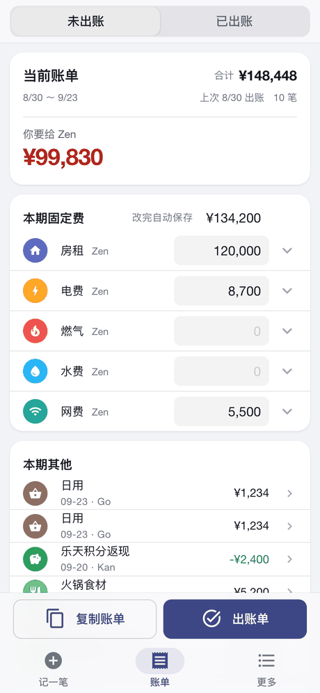
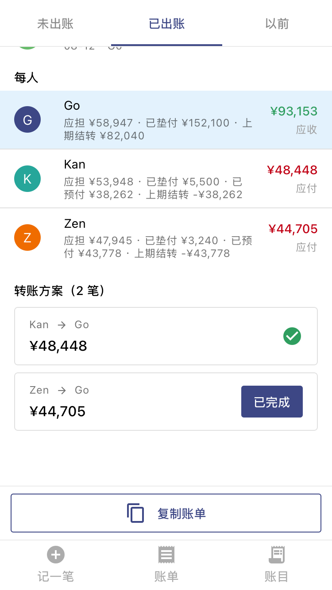
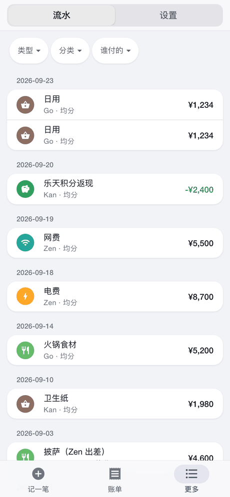
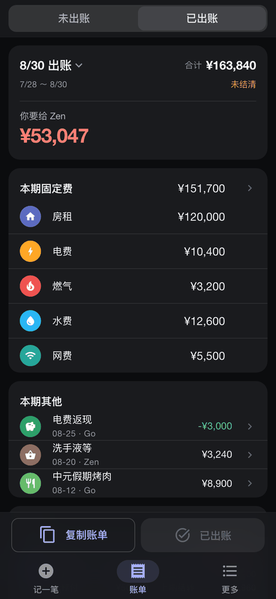

<div align="center">

# 長屋 nagaya

**日本合租的记账 / 分摊工具。手机优先，自托管，一个端口一个进程。**

  

<sub>记一笔 · 未出账的账单 · 出过的账单</sub>

 

<sub>流水 · 深色模式</sub>

</div>

> 名字取自江户时代庶民合住的联排出租屋 —— 落語《長屋の花見》里那帮穷邻居凑份子办赏花，
> 跟这个项目要干的事是一回事。

---

## 它解决什么

几个人合租，钱通常从一个人卡上出，隔一阵大家把账结给他。麻烦的从来不是加减法，是这些：

- **每笔账该谁担，规则不一样。** 房租按房间大小（有人多担 5,000）、水电按人头、
  某顿饭有人出差没参与。分摊得能写成「同权 + 谁多担多少」，还得能把某个人整个排除出去。
- **有人没按时转钱。** 差额不该丢，得原样滚到下一张账单上。
- **账记错了要能改。** 而且改完不能把已经发出去的那张账单悄悄改掉。
- **水费两个月才收一次**，房租一年不动，日用品天天有 —— 录入的频率差一个数量级，
  不该用同一套交互。

它做的：记账 → 到点「出账单」划一条线 → 生成「谁给谁多少」→ 转完钱点一下 → 没转清的自动结转。

## 功能

| | |
|---|---|
| **记一笔** | 顶上四格：支出 / 收入 / 转账 / 备忘。金额 → 分类 → 记入账。分摊一直摊开着：点头像把某人排除出这笔，比例在行内左右拨（0–9），调整额直接填。日期能往回调，最早到上次出账那天。**断网也能记**：存成草稿，回来一键补交（带幂等键，响应丢在路上也不会记两笔） |
| **账单** | 两页：**未出账 / 已出账**，更早的单子从标题那个名字翻。固定费（房租水电网）在账单页一屏填完，**没填就是 0、照样能出账**。每期不变的项在设置里开「和上期一样」：那一行上出现「照上期」，**点了才**按上期金额记（出账对话框里也有一个默认勾上的「先按上期记上」）。出过的单子列出全部固定费，没填的按 ¥0。「谁给谁多少」和「确认已完成」按的是**此刻**的余额；「复制账单」生成一段带链接的文字贴群里 |
| **流水** | 在「更多」里。按类型 / 分类 / 付款人筛，筛完给合计；出过的账单夹在日期中间。点一条进去改，固定费点进去是固定费那一屏 |
| **设置** | 在「更多」里。**个人**：头像、昵称、登录名、语言、深浅色、主题色、密码、退出登录 —— 都跟着账号走，换台手机登录还是自己那一套。**应用设置**：这屋的 App 叫什么、图标长什么样。**成员**：加人（给初始密码）、改入住日、标记搬走。**固定费项目**、**系统设置**、**备份** |

两种语言（中文 / 日本語），跟人走 —— 每个成员各自设定，界面文案和弹框按钮一起切。
**分类名这种用户数据不翻译。**

## 四条最要紧的设计

**1. 分摊结果是落库快照，不是查询时现算。**
每笔账在记下的那一刻就把「谁担多少」写进 `entry_share`。第 4 个人搬进来、改默认比例、
删分类 —— 历史账单一个数字都不会变。这条实测过：加一个成员之后，三个月前那张账单
逐人金额完全一致。

**2. 账单按「点出账单那一刻」切，不按日历。**
没出账的账目合起来就是当前草稿；点一下划线、冻结快照，之后记的进下一张。
没有账期、没有起算日 —— 那套日历边界曾经带来一长串 bug（起算日改了导致账期重叠等），
删掉那一版净减 300 多行代码（816 增 1138 删），功能反而更多。

**3. 不锁定历史，但改动必须看得见。**
已出账的账目照样能改。余额是全局累计的（`Σ垫付 − Σ应担`，恒等于 0），
多付少付的差额原样进下一张的「上期结转」，钱算不错。代价是那张单子会标出
「出账后被改过 N 处：当初 ¥X，现在 ¥Y」，并且**它的转账方案冻结不动** ——
那是出账那一刻大家照着转的钱，一变，按下标对位的「已完成」勾就会对到别的行上。

**4. 分摊算法前后端各写一份，靠共享用例锁住不漂。**
前端要本地即时预览（不能每改个比例就往返一次），后端绝不信任客户端传来的金额。
两份实现跑 `tests/fixtures/` 下同一批用例：23 条手写 + 500 条随机生成。
改了后端算法却没重新生成随机用例的话，后端有一条测试会红。

---

## 部署

### 一键部署

```bash
git clone <这个仓库> nagaya && cd nagaya

sudo bash deploy.sh             # 直接装在 Linux 上：Debian / Ubuntu 的 LXC、虚拟机、裸机（systemd）
bash deploy.sh --docker         # 用 Docker：NAS、或者任何装了 Docker 的机器（Mac 也行）
```

第一次跑会中途问几句，回车就是默认：

| 问什么 | 什么时候问 |
|---|---|
| 端口（默认 8000） | 第一次。之后沿用，不再问 —— 换端口的话手机主屏上那个图标就作废了 |
| 要不要把旧机器的账本搬过来 | 还没有账本（或者账本里一个人都没有）时。给一份**备份文件**的路径，它会先验、升到现在的表结构再装上 |
| 备份放哪 | 直接装时第一次问（建议外接盘、NAS 共享目录）；搬过来的账本里记着的目录在这台机器上用不了时也问 |
| 第一个账号 | 账本里一个人都没有时。密码在它自己那儿输两遍 |

`NAGAYA_YES=1 bash deploy.sh` 什么都不问、全用默认；`PORT=9001 bash deploy.sh` 预设端口。

**直接装**做的事：装 [uv](https://github.com/astral-sh/uv)（自带独立的 Python 3.12，不碰系统的）→ 装后端依赖 →
系统里没有够新的 Node 才装一份（放在项目的 `.tools/` 里，校验过哈希）→ 打包前端 →
写 `/etc/systemd/system/nagaya.service` 并启动 → 真去打一次接口确认是它在应答。
日志 `journalctl -u nagaya -f`，重启 `systemctl restart nagaya`。

**Docker** 做的事：打镜像（Node 只在打包那一段用，最终镜像里只有 Python）→ `docker compose up -d`。
账本和备份挂在宿主机的 `backend/data`、`backend/backups`（和直接装是同一个位置），
删容器、重建镜像都不碰它们；容器以这两个目录主人的身份写文件，在宿主机上不用 sudo 就打得开。
端口和身份记在项目根目录的 `.env` 里。不想用脚本的话，`docker compose up -d --build` 一句也行，
再建第一个账号：`docker compose exec nagaya .venv/bin/python -m tools.add_member go Go`。
日志 `docker compose logs -f`。下面 `tools.*` 的命令在 Docker 下都是 `docker compose exec nagaya .venv/bin/python -m tools.…`。

### 更新到新版本

```bash
git pull && sudo bash deploy.sh          # Docker：git pull && bash deploy.sh --docker
```

不问问题、不碰账本。表结构变了的话**开机自动升级**，升之前在 `backend/data/` 里留一份
`before-migrate-<版本>-<时间>.db` 快照。升完核对库和代码，对不上就拒绝启动并说清缺了什么 ——
不会带着问题跑起来。

### 手动装（不想用脚本、或者在 Mac 上直接跑）

要 **Python 3.11+**（开发用的 3.12；锁定的依赖里有要 3.11 的）和 **Node 22.12+ 或 24**（只在打包前端时要）。

```bash
cd backend
python3 -m venv .venv
.venv/bin/pip install -r requirements.lock     # 装钉死的那一组，别装 requirements.txt（见下）

cd ../frontend
npm ci && npm run build                         # 类型检查 + 打包 → frontend/dist/pwa

cd ../backend
.venv/bin/python -m tools.add_member go Go      # 第一个账号：登录名 go，显示名 Go，密码输两遍（≥6 位）
./run.sh                                        # 前台跑，监听 0.0.0.0:8000；PORT=9001 ./run.sh 换端口
```

**装 `requirements.lock`，不装 `requirements.txt`**：后者只写下限，新机器上会装到最新版 ——
实测 sqlmodel 0.0.46 起拒收不带时区的时间，全新部署直接起不来。lock 是全部测试在上面过了的那一组。

**先打包前端再起服务**：后端开机时认一次 `frontend/dist/pwa` 在不在。
库、日志、签名密钥新建出来都只有自己能读（后端和 `tools.*` 一律 `umask 077`）。
以前装的、账本别人也能读的话，收紧一次就行：`chmod 700 data && chmod 600 data/nagaya.db*`。

`tools.add_member` 之后也能接着用：`--list` 看有谁；`--reset go` 重置某人的密码（顺带把他所有设备
踢下线）—— **忘了密码只能走这条**，界面上密码只许本人改。其他人也可以在界面上加（更多 → 设置 → 成员）。

> 别拿 `tools.seed_dev` 开张：它建的是三个假室友（go / kan / zen，密码 dev12345）和几个月的假账，
> 还顺手关掉了自动备份。那是开发和截图用的。

### 手机上用

1. 查这台机器的局域网 IP：macOS `ipconfig getifaddr en0`，Linux `hostname -I`
2. 手机连同一个 WiFi，Safari 打开 `http://<IP>:8000`，登录
3. **先在「更多 → 设置 → 应用设置」里定好名字和图标**，再添加到主屏幕 ——
   iOS 只在添加的那一刻读名字和图标，之后改了主屏上也不变。
   怎么添加，设置页最底下「添加到主屏幕」里按这台手机、这个浏览器写好了步骤
4. 从主屏打开就是一个全屏 App。要看新版本：从多任务里划掉再开（局域网 http 下开一次就是新的）

### HTTPS

局域网里用 `http://` 能用、也能加到主屏，但浏览器只在安全连接（HTTPS 或 localhost）下
才启用 service worker，所以：

- **没有离线冷启动**：断网时打不开（在线时记一笔断了网，照样能存成草稿）
- 「复制账单」在一些浏览器上要退回长按复制
- 登录 token 在局域网里是明文

要出门在外也能用，或者想要上面这些，前面套一层 TLS：**Tailscale**（`tailscale serve`）、
**Cloudflare Tunnel** 或 **Caddy** 反代都行。仓库里不带这些配置。

反代和后端**在同一台机器**上（`tailscale serve`、本机的 cloudflared / Caddy）什么都不用配：
后端默认就认 127.0.0.1 转过来的真实来源。反代在**别的机器**上、或者用 Docker 的话，
要把反代的地址告诉后端，不然后端看到的「来源」全是反代，登录节流就从「按机器」退化成「按名字」——
外面谁对着你的登录名连错几次，你在新手机上也会被挡一阵：

- 直接装：`sudo systemctl edit nagaya`，写 `[Service]` 和 `Environment=FORWARDED_ALLOW_IPS=127.0.0.1,::1,<反代的 IP>`
  （写在这儿的，升级时 deploy.sh 不会覆盖；别直接改 `nagaya.service`，那个每次部署都重写）
- Docker：宿主机上的反代连进容器时，来源是 Docker 网络的网关（多半在 `172.16.0.0/12` 里）。
  在项目根目录的 `.env` 里加一行 `FORWARDED_ALLOW_IPS=127.0.0.1,::1,172.16.0.0/12`，再 `docker compose up -d`

填的值会**整个替换**默认的 `127.0.0.1,::1`，所以这两个要一起写上。**别写成 `*`**：那样谁都能伪造来源绕过节流。

---

## 备份与恢复

每 24 小时自动备一份（间隔、保留份数、目录都在「系统设置」里改，间隔填 0 就不自动备），
「备份」卡片上也有「立即备份」。每一份都是一个**能单独打开的完整库文件**，
默认放在 `backend/backups/`。

> **别只拷 `nagaya.db`。** 库开着 WAL，还没 checkpoint 的数据全在 `nagaya.db-wal` 里 ——
> 实测主文件 4096 字节、`-wal` 3.9MB，单拷主文件那份**连打开都打不开**。
> 备份走的是 `VACUUM INTO`，把 WAL 一并结算进去，产出的是单文件（顺带还压实了）。

产出的每一份都**当场验过**才算数：独立连接只读打开、`integrity_check`、
外键检查、逐表和源库对条数，不通过就删掉 —— 宁可没有备份，也不要一份骗人的备份。
账本是空的时候不备份、**也不轮转**（防的是「库被误删之后备份照跑，
几天内把每一份好备份都转掉」）。

### 恢复

```bash
cd backend
.venv/bin/python -m tools.restore --list                  # 看有哪些（每份带着笔数和成员名）
# 先把服务停掉，然后：
.venv/bin/python -m tools.restore                         # 用最新那份
.venv/bin/python -m tools.restore nagaya-20260922-133226.db
.venv/bin/python -m tools.restore --dir=/Volumes/USB/backups --yes   # 备份不在默认目录 / 不问直接做
```

Docker 部署的：服务停了 `exec` 就进不去，用一次性容器跑（`--dir` 写容器里的路径）：

```bash
docker compose run --rm --no-deps nagaya .venv/bin/python -m tools.restore --list
docker compose stop nagaya
docker compose run --rm --no-deps nagaya .venv/bin/python -m tools.restore      # 用最新那份
docker compose start nagaya
```

脚本会先验那份备份、**再把它的一份拷贝升到现在的表结构**（和开机同一套迁移，原件不动），
然后把现在的账本整个挪到 `data/replaced-*/`（不删，恢复错了还能回头），最后才换上去。
所以改表结构之前做的备份照样能恢复；升不上来的（更新的代码做的、2026-09-23 之前的旧格式）当场拦下，现有的账本不动。
**库彻底没了、换了新机器**也能跑 —— 那正是最需要它的时候。

> **为什么不手工拷。** 恢复只有一步危险，而它长得完全不像危险：把 `.db` 拷回去却
> 留着旧的 `nagaya.db-wal`，SQLite 会把旧 WAL 的页盖到新文件上 —— 实测 44 笔的备份
> 恢复出来读到 127 笔，再读就是 `database disk image is malformed`。
> 脚本把 `-wal` / `-shm` 一起处理掉，正是为了堵这一步。

密码都在库里，恢复之后照旧能登。**换了机器**的话大家要重新登录一次 ——
签名密钥 `backend/data/.secret` 不在备份里（它是凭据，不该到处复制）。

> 两件事值得先想清楚：
> - **那份文件是整本账的明文**（含密码哈希和头像）。指到 iCloud 就等于
>   「谁有那个账号谁就有整本账」—— 防盘坏和保密这两件事得自己权衡。外接盘或 NAS 更稳妥。
> - 设置表也在备份里，**包括备份目录它自己**。恢复一份老备份之后备份目录会跟着回滚，
>   脚本会把回滚后的值打出来提醒一句。

## 改表结构（迁移）

表结构走 Alembic。改完 `backend/app/models.py` 要写一份迁移（`backend/alembic/versions/README.md`
里有步骤和要手改的几种情况），提交之后**开机自动升级**，不用手动跑 `alembic upgrade`。

漏写迁移的话 `tests/test_migrations.py` 会红：它把「从空库一路升到最新」和模型逐表逐列逐索引比一遍。
想先自己看一眼：`NAGAYA_DB=<升到最新的空库> .venv/bin/alembic check`。

---

## 设置项

都在「更多 → 设置」里改，存在库里（跟着备份走）。

| 设置 | 默认 | 管什么 |
|---|---|---|
| 默认垫付人 | 空 | 记一笔时付款人预先填成他（他搬走了就退回自己） |
| 余数归谁 | 付款人 | 除不尽时多出来的 1 円：付款人 / 按成员顺序 / 逐笔轮转 |
| 默认分摊规则 | 全员同权 | 分类没定规则时用它 |
| 最少转账方案 | 开 | 出账时算「最少几笔转账」（3 人最多 2 笔）；关掉则按原始债权逐笔还 |
| 兜底分类 | 其他 | 支出没点分类、但写了备注时记到哪 |
| 固定费间隔天数 | 20 | 距上次出账不足这么多天，出账对话框默认不勾「包括固定费」 |
| 备份目录 / 间隔（小时）/ 保留份数 | `./backups` / 24 / 30 | 见上面「备份与恢复」 |

App 名字和图标在「应用设置」那张卡片里改。`settlement_methods` 是占位，还没有任何地方读它。

## 环境变量

| 变量 | 默认 | 说明 |
|---|---|---|
| `NAGAYA_DB` | `backend/data/nagaya.db` | 库文件。签名密钥 `.secret` 和升级前的快照放在它旁边 |
| `NAGAYA_SECRET` | 自动生成 | token 签名密钥。不给就生成一个写进库旁边的 `.secret`（权限 600） |
| `PORT` | `8000` | `run.sh` 监听的端口 |
| `NAGAYA_CORS` | `localhost:9000,5173` | 前端开发服务器的源，只在开发时用得上 |
| `NAGAYA_YES` | 空 | `deploy.sh` 设了就什么都不问、全用默认 |
| `NAGAYA_PORT` / `NAGAYA_UID` / `NAGAYA_GID` | 8000 / 0 / 0 | Docker 部署时写在项目根目录的 `.env` 里：对外端口、容器以谁的身份写文件（`deploy.sh --docker` 会替你写） |
| `NAGAYA_URL` | `http://127.0.0.1:8765` | E2E 打哪个服务（`run-e2e.sh` 会自己设；默认值故意不是 8000） |
| `E2E_PORT` | `8765` | `run-e2e.sh` 起测试服务用的端口 |

---

## 开发

```bash
# 后端照常跑着（./run.sh），前端开发服务器：
cd frontend && npm run dev          # localhost:9000，/api 代理到 8000，改了即刷新
```

### 测试

```bash
cd backend  && .venv/bin/python -m pytest   # 240 条：算法 / 账本 / 账单 / API / 边界输入 / 随机操作序列 / 备份恢复 / 迁移
cd frontend && npm test                     # 161 条：分摊引擎（对后端 fixture）+ 若干守卫（对比度、缓存竞态……）
./run-e2e.sh                                # 47 条：375px 手机视口，真浏览器（WebKit）
```

只查类型用 `cd frontend && npm run typecheck`。别拿 `npm run build` 查：它会覆盖 `dist/pwa`，
而 8000 上的服务正发着这个目录 —— 查一下类型就等于把没改完的前端推到了大家手机上。

第一次跑 E2E 之前：`cd frontend && npx playwright install webkit`。

`run-e2e.sh` 用**自己的端口（8765）和自己的库**（`backend/data/e2e.db`）：每次重置到确定基线、
跑完删掉，不碰 8000 上那个服务和 `nagaya.db`。E2E 是真往库里写的，不重置的话残渣会让下一轮的
用例红在一个跟它毫无关系的地方。它会重新打包前端（`dist/pwa` 和线上共用，打出来的就是当前代码）。

改了后端的分摊算法，要重新生成那 500 条随机用例：`cd backend && .venv/bin/python -m tools.gen_random_cases`。

几条守卫测试值得一提，它们各自都真的抓到过 bug：

| 守卫 | 防的是 |
|---|---|
| `i18n-keys` | 代码里 `t('x.y')` 用了但词条没有；zh / ja 两边键不一致；词条没人用了 |
| `error-codes` | 后端会抛出来的错误码，前端两种语言都得有话说 |
| `e2e-selectors` | E2E 里的 class 在源码里根本不存在 —— Playwright 对着它只会超时，报的是「等不到元素」 |
| `theme` / `contrast` | 三种账目的颜色各处写的对不上；文字对比度（浅色、深色、每一档主题色）不够 |
| `no-bare-cjk` | `.vue` 里直接写中日文，绕过 i18n |
| `test_migrations` | 改了模型没写迁移 |
| 随机用例过期 | 改了后端分摊算法却没重新生成 fixture —— 那正是前端还在按旧算法预览的危险时刻 |

### 技术栈

| | |
|---|---|
| 前端 | Vue 3 + TypeScript + Vite + **Quasar** + Pinia，`vite-plugin-pwa` 打成 PWA，vue-i18n 中日双语 |
| 后端 | FastAPI + SQLModel + **SQLite (WAL)** + Alembic，JWT 登录（90 天），响应 gzip |
| 金额 | **整数日元，前后端都禁 float**。除不尽时用最大余数法，余数归谁可配 |
| 部署 | 打包后 FastAPI 挂 `frontend/dist/pwa`，**一个端口一个进程** |

### 目录

```
backend/
  app/
    core/          分摊算法、规则解析、转账方案（纯函数，不碰库）
    services/      账本、账单、出账、备份
    routers/       REST 接口
    models.py      表结构        migrate.py  开机升级
    settings_spec.py  设置项登记表（加一个面板可改的设置，从这里下手）
    errors.py      路由层的错误码（前端按码出中日文案）
  alembic/         迁移（versions/README.md 是改表的步骤）
  tools/           add_member / restore / seed_dev / gen_random_cases / gen_icons
  tests/
frontend/
  src/
    pages/ components/ layouts/   界面
    stores/        Pinia：账本、账单缓存、成员分类设置、草稿
    core/          分摊算法（和后端同一份用例）
    i18n/          zh.ts / ja.ts
    css/           tokens.css（颜色、字号、深色）/ skin.css
  test/            vitest        e2e/  Playwright
tests/fixtures/    前后端共用的分摊用例
deploy.sh          一键部署（systemd，或 --docker）   Dockerfile / docker-compose.yml
run-e2e.sh         E2E：自己的端口和库，跑完就删
docs/
  SPEC.md          任务书：每条决策「为什么是这样」
  AUDIT-2026-09.md 几轮审计的记录、替你定的事、还欠着的
```

动手改之前先读 **[`docs/SPEC.md`](docs/SPEC.md)** —— 每条决策都写了「为什么是这样」，
而不只是「是这样」。
